# Serverless ATM Web App

A **serverless web-based ATM simulation** using AWS (S3, Lambda, API Gateway, DynamoDB, SNS, CloudFront) with modern UI, real-time transaction receipts, and secured public access.

---

## Overview

This project is a **fully functional ATM simulation** built using **AWS serverless technologies**. Users can:

* **Create an account** with name, email, phone, and PIN
* **Login** securely using account ID and PIN
* **Check balance** in real-time
* **Deposit and withdraw funds**
* Receive **dynamic ATM-style receipts** on the webpage
* Get **transaction alerts via SMS and email** using **AWS SNS**
* Access the frontend securely via **CloudFront** with controlled public access

---

## Features

* **Serverless architecture**: No servers to manage; uses AWS Lambda + API Gateway  
* **DynamoDB integration**: Accounts and transactions stored in **NoSQL DynamoDB tables**  
* **Modern, responsive UI**: Includes **ATM-style receipt printing**  
* **Realistic transaction alerts**: Notifications sent to users via **AWS SNS**  
* **UTF-8 support**: Proper display of the **₹ currency symbol**  
* **Secure and fast hosting**: Frontend delivered via **AWS CloudFront** with restricted public access, caching, and HTTPS  

---

## Tech Stack

* **Frontend**: HTML, CSS, JavaScript  
* **Backend**: AWS Lambda (Python)  
* **Storage**: Amazon DynamoDB  
* **API**: Amazon API Gateway  
* **Hosting**: Amazon S3 + CloudFront  
* **Notifications**: AWS SNS for email/SMS alerts  
* **Security & Performance**: AWS CloudFront CDN to protect S3 bucket, provide HTTPS, and speed up content delivery  

---

## How It Works

1. User interacts with the **web interface** hosted on S3 and delivered via **CloudFront**  
2. All requests (create, login, deposit, withdraw, balance) are sent to **Lambda via API Gateway**  
3. Lambda updates **DynamoDB** and sends back JSON responses  
4. The frontend **parses the responses** and prints **ATM-style receipts** dynamically  
5. For deposits/withdrawals, AWS SNS **sends SMS/email notifications** in real-time  
6. CloudFront ensures **secure access**, HTTPS delivery, and optional access restrictions  

---

## Setup Instructions

1. Deploy **accounts** and **transactions** tables in DynamoDB  
2. Create **Lambda function** with full access to DynamoDB and SNS  
3. Configure **API Gateway** with POST `/atm` endpoint connected to Lambda  
4. Host frontend in **S3 static website** and set up **CloudFront** distribution  
5. Update API URL in JS to use **CloudFront domain**  
6. Subscribe an email/phone number in **SNS topic** to receive transaction alerts  
7. Optionally restrict CloudFront access using **signed URLs or OAI** (Origin Access Identity) to protect the S3 bucket  

---

## Screenshots

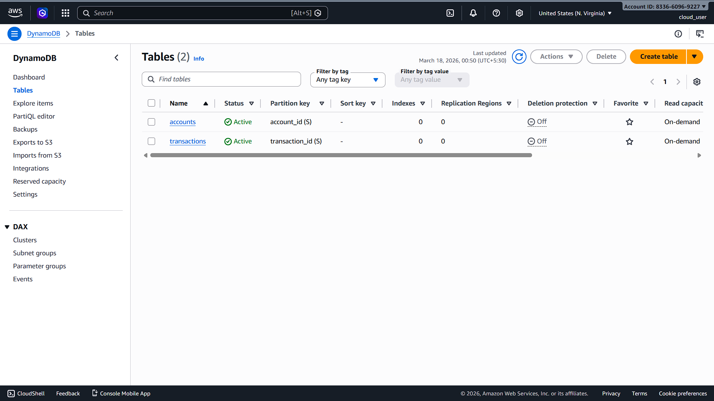
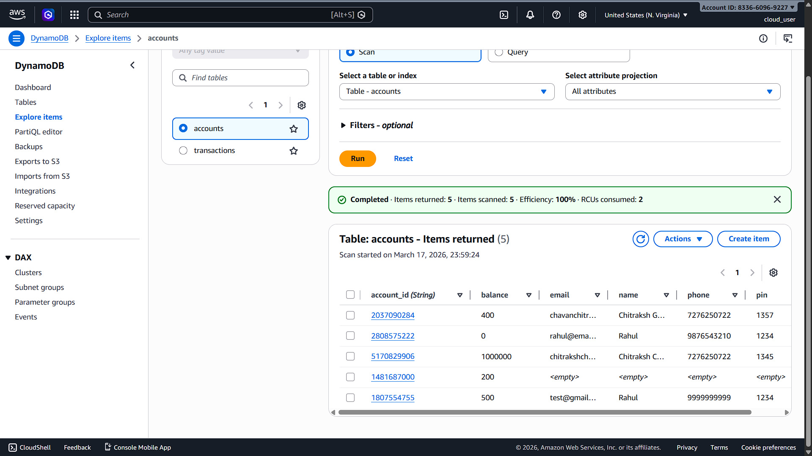
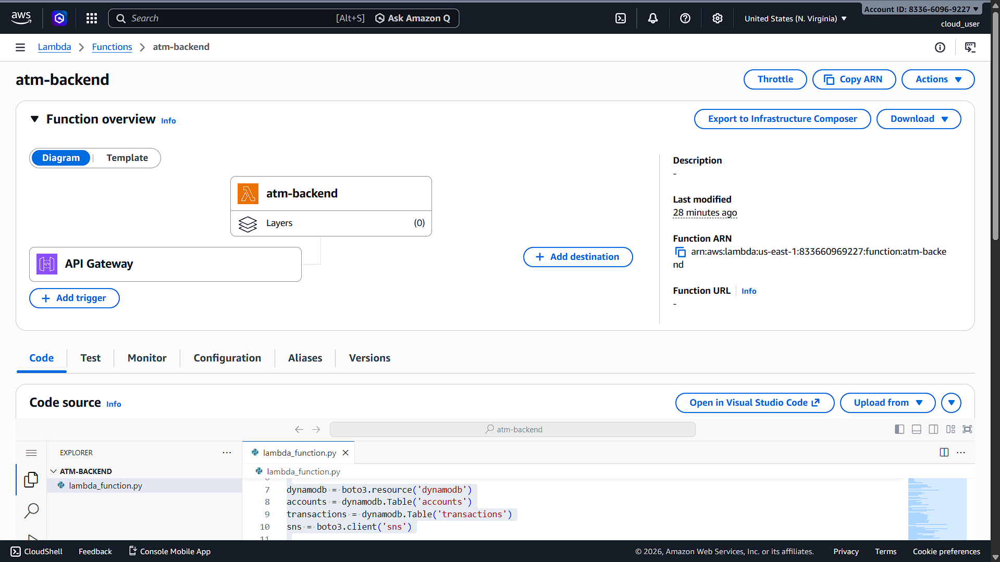
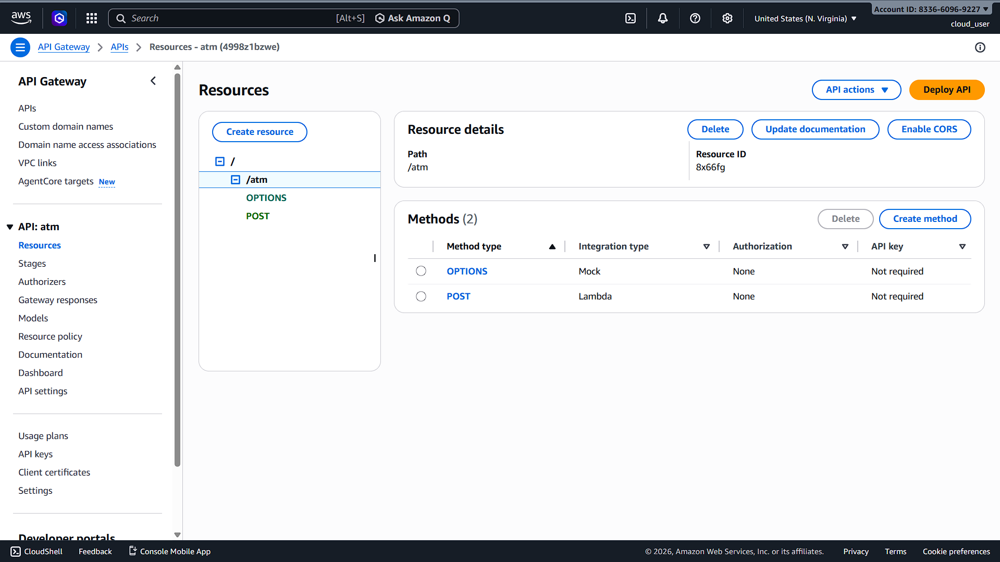
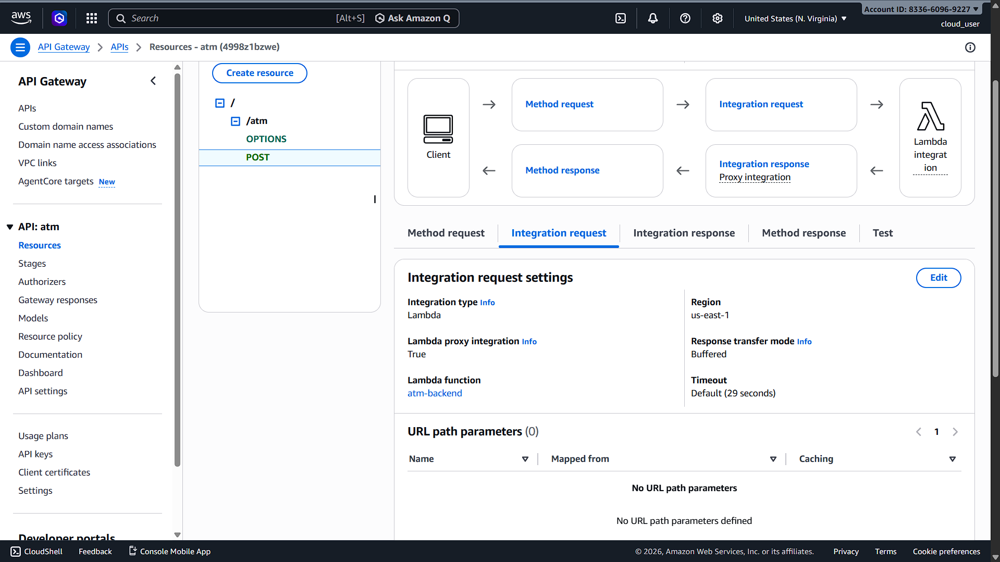
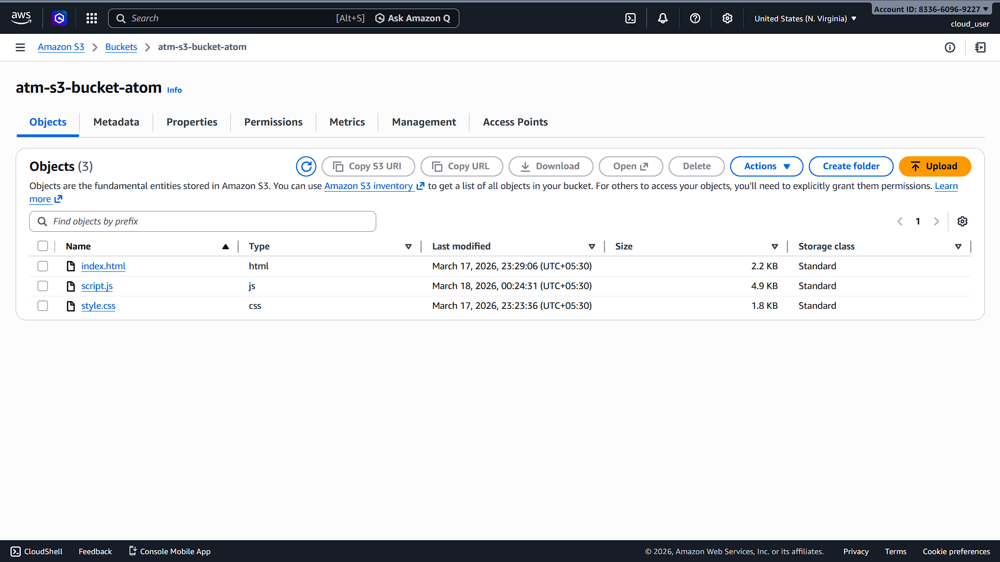
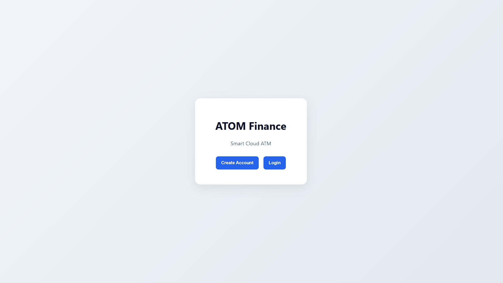
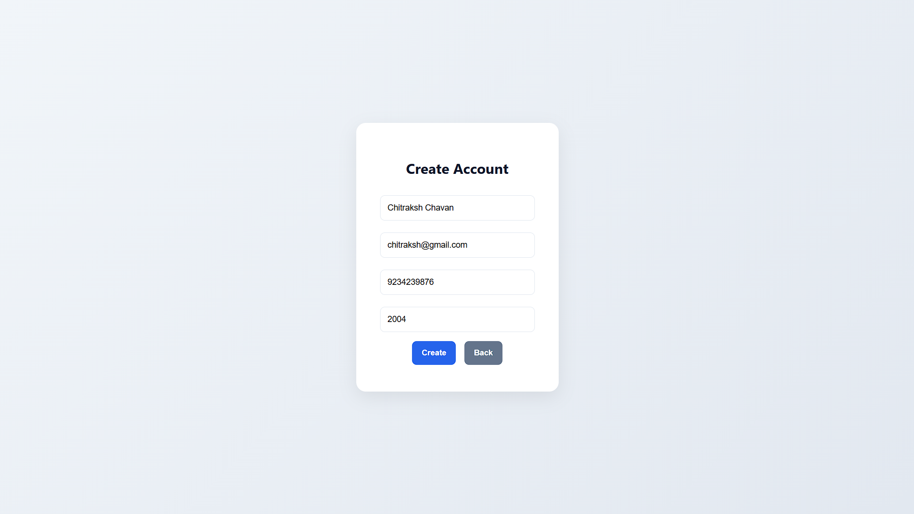
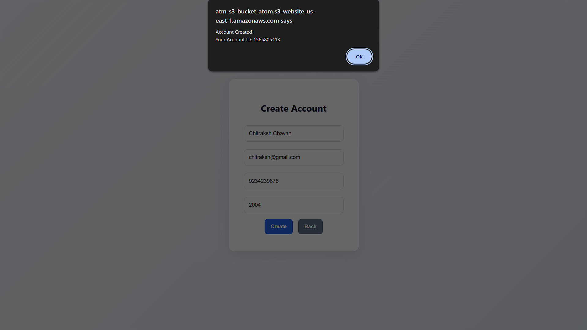
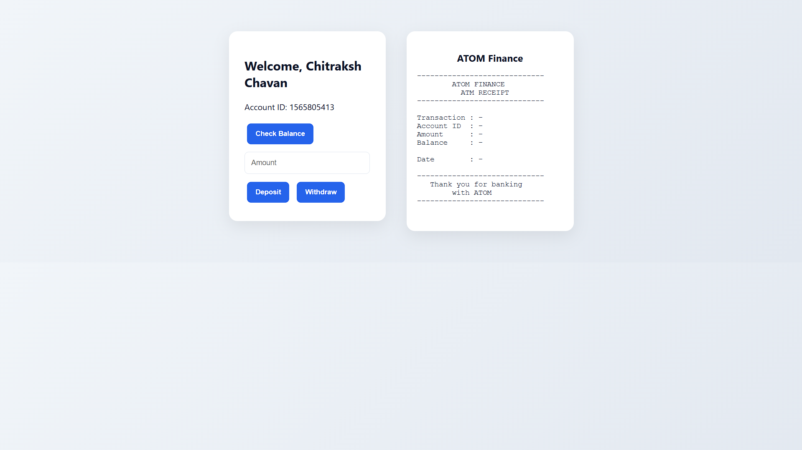
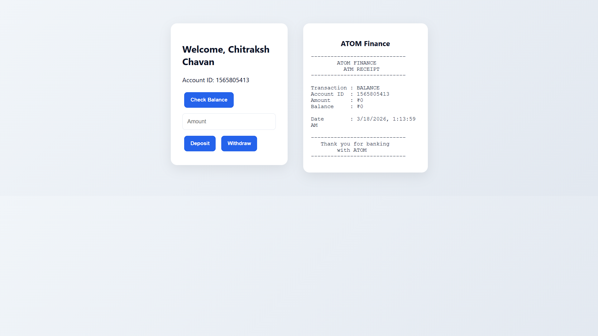
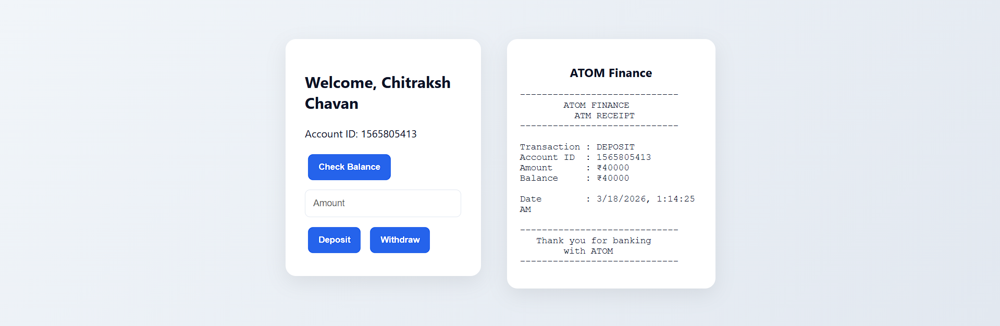

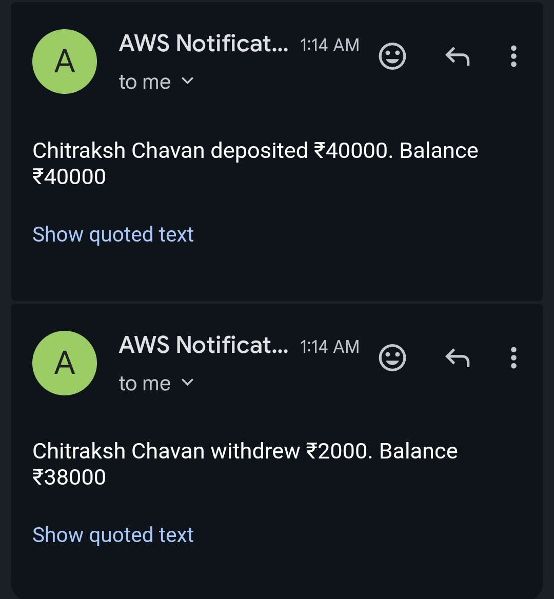

---

**Author:** Chitraksh Chavan